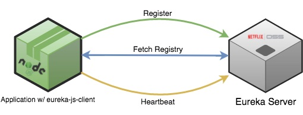

# eureka-js-client
[](http://badge.fury.io/js/eureka-js-client) [](https://travis-ci.org/jquatier/eureka-js-client) [](https://coveralls.io/github/jquatier/eureka-js-client?branch=master) [](https://david-dm.org/jquatier/eureka-js-client) [](https://www.bithound.io/github/jquatier/eureka-js-client)

A JavaScript implementation of a client for Eureka (https://github.com/Netflix/eureka), the Netflix OSS service registry.



## Usage

First, install the module into your node project:

```shell
npm install eureka-js-client --save
```

### Add Eureka client to a Node application.

The Eureka module exports a JavaScript function that can be constructed.

```javascript
import Eureka from 'eureka-js-client';

// Or, if you're not using a transpiler:
const Eureka = require('eureka-js-client').Eureka;

// example configuration
const client = new Eureka({
  // application instance information
  instance: {
    app: 'jqservice',
    hostName: 'localhost',
    ipAddr: '127.0.0.1',
    port: 8080,
    vipAddress: 'jq.test.something.com',
    dataCenterInfo: {
      name: 'MyOwn',
    },
  },
  eureka: {
    // eureka server host / port
    host: '192.168.99.100',
    port: 32768,
  },
});
```

The Eureka client searches for the YAML file `eureka-client.yml` in the current working directory. It further searches for environment specific overrides in the environment specific YAML files (e.g. `eureka-client-test.yml`). The environment is typically `development` or `production`, and is determined by environment variables in this order: `EUREKA_ENV`, if present, or `NODE_ENV`, if present. Otherwise it defaults to `development`. The options passed to the constructor overwrite any values that are set in configuration files.

You can configure a custom directory to load the configuration files from by specifying a `cwd` option in the object passed to the `Eureka` constructor.

```javascript
const client = new Eureka({
  cwd: `${__dirname}/config`,
});
```

If you wish, you can also overwrite the name of the file that is loaded with the `filename` property. You can mix the `cwd` and `filename` options.

```javascript
const client = new Eureka({
  filename: 'eureka',
  cwd: `${__dirname}/config`,
});
```

### Register with Eureka & start application heartbeats

```javascript
client.start();
```

### De-register with Eureka & stop application heartbeats

```javascript
client.stop();
```

### Get Instances By App ID

```javascript
const instances = client.getInstancesByAppId('YOURSERVICE');
```

### Get Instances By Vip Address

```javascript
const instances = client.getInstancesByVipAddress('YOURSERVICEVIP');
```

### Providing Custom Request Middleware
The client exposes the ability to modify the outgoing [request](https://www.npmjs.com/package/request) options object prior to a eureka call. This is useful when adding authentication methods such as OAuth, or other custom headers. This will be called on every eureka request, so it highly suggested that any long-lived external calls made in the middleware are cached or memoized. If the middleware returns anything other than an object, the eureka request will immediately fail and perform a retry if configured.

```javascript
// example using middleware to set-up HTTP authentication
const client = new Eureka({
  requestMiddleware: (requestOpts, done) => {
    requestOpts.auth = {
      user: 'username',
      password: 'somepassword'
    };
    done(requestOpts);
  }
});
```

## Configuring for AWS environments

For AWS environments (`dataCenterInfo.name == 'Amazon'`) the client has built-in logic to request the AWS metadata that the Eureka server requires. See [Eureka REST schema](https://github.com/Netflix/eureka/wiki/Eureka-REST-operations) for more information.

```javascript
// example configuration for AWS
const client = new Eureka({
  // application instance information
  instance: {
    app: 'jqservice',
    port: 8080,
    vipAddress: 'jq.test.something.com',
    statusPageUrl: 'http://__HOST__:8080/info',
    healthCheckUrl: 'http://__HOST__:8077/healthcheck',
    homePageUrl: 'http://__HOST__:8080/',
    dataCenterInfo: {
      name: 'Amazon',
    },
  },
  eureka: {
    // eureka server host / port / EC2 region
    host: 'eureka.test.mydomain.com',
    port: 80,
  },
});
```

Notes:
  - Under this configuration, the instance `hostName` and `ipAddr` will be set to the public host and public IP that the AWS metadata provides. You can set `eureka.useLocalMetadata` to `true` to use the private host and private IP address instead.
  - If you want to register using the IP address as the hostname, set `eureka.preferIpAddress` to `true`. This may be used in combination with `eureka.useLocalMetadata` for selecting the private or public IP.
  - For status and healthcheck URLs, you may use the replacement key of `__HOST__` to use the host from the metadata.
  - Metadata fetching can be disabled by setting `config.eureka.fetchMetadata` to `false` if you want to provide your own metadata in AWS environments.

### Looking up Eureka Servers using DNS
If your have multiple availability zones and your DNS entries set up according to the Wiki article [Deploying Eureka Servers in EC2](https://github.com/Netflix/eureka/wiki/Deploying-Eureka-Servers-in-EC2#configuring-eips-using-dns), you'll want to set `config.eureka.useDns` to `true` and set `config.eureka.ec2Region` to the current region (usually this can be pulled into your application via an environment variable, or passed in directly at startup).

This will cause the client to perform a DNS lookup using `config.eureka.host` and `config.eureka.ec2Region`. The naming convention for the DNS TXT records required for this to function is also described in the Wiki article above. This feature will also work in non-EC2 environments as long as the DNS records conform to the same convention. The results of the DNS resolution are cached in memory and refreshed every 5 minutes by default (set `config.eureka.clusterRefreshInterval` to override).

##### Zone Affinity
By default, the client will first try to connect to the Eureka server located in the same availability-zone as it's currently in. If `availability-zone` is not set in the instance metadata, a random server will be chosen. This also applies when statically configuring the cluster (mapped by zone, see below). To disable this feature, set `config.eureka.preferSameZone` to `false`, and a random server will be chosen.

### Statically configuring Eureka server list
While the recommended approach for resolving the Eureka cluster is using DNS (see above), you can also statically configure the list of Eureka servers by zone or just using a simple default list. Make sure to provide the full protocol, host, port, and path to the Eureka REST service (usually `/apps/`) when using this approach.

#### Static cluster configuration (map by zone)

```javascript
// example configuration for AWS (static map of Eureka cluster by availability-zone)
const client = new Eureka({
  instance: {
    ... // application instance information
  },
  eureka: {
    availabilityZones: {
      'us-east-1': ['us-east-1c', 'us-east-1d', 'us-east-1e']
    },
    serviceUrls: {
      'us-east-1c': [
        'http://ec2-fake-552-627-568-165.compute-1.amazonaws.com:7001/eureka/v2/apps/', 'http://ec2-fake-368-101-182-134.compute-1.amazonaws.com:7001/eureka/v2/apps/'
      ],
      'us-east-1d': [...],
      'us-east-1e': [...]
    }
  },
});
```

#### Static cluster configuration (list)

```javascript
// example configuration (static list of Eureka cluster servers)
const client = new Eureka({
  instance: {
    ... // application instance information
  },
  eureka: {
    serviceUrls: {
      default: [
        'http://ec2-fake-552-627-568-165.compute-1.amazonaws.com:7001/eureka/v2/apps/', 'http://ec2-fake-368-101-182-134.compute-1.amazonaws.com:7001/eureka/v2/apps/'
      ]
    }
  },
});
```

## Advanced Configuration Options
option | default value | description
---- | --- | ---
`requestMiddleware` | noop | Custom middleware function to modify the outgoing [request](https://www.npmjs.com/package/request) to eureka
`logger` | console logging | logger implementation for the client to use
`shouldUseDelta` | false | Experimental mode to fetch deltas from eureka instead of full registry on update
`eureka.maxRetries` | `3` | Number of times to retry all requests to eureka
`eureka.requestRetryDelay` | `500` | milliseconds to wait between retries. This will be multiplied by the # of failed retries.
`eureka.heartbeatInterval` | `30000` | milliseconds to wait between heartbeats
`eureka.registryFetchInterval` | `30000` | milliseconds to wait between registry fetches
`eureka.registerWithEureka` | `true` | enable/disable Eureka registration
`eureka.fetchRegistry` | `true` | enable/disable registry fetching
`eureka.filterUpInstances` | `true` | enable/disable filtering of instances with status === `UP`
`eureka.servicePath` | `/eureka/v2/apps/` | path to eureka REST service
`eureka.ssl` | `false` | enable SSL communication with Eureka server
`eureka.useDns` | `false` | look up Eureka server using DNS, see [Looking up Eureka Servers in AWS using DNS](#looking-up-eureka-servers-in-aws-using-dns)
`eureka.preferSameZone` | `true` | enable/disable zone affinity when locating a Eureka server
`eureka.clusterRefreshInterval` | `300000` | milliseconds to wait between refreshing cluster hosts (DNS resolution only)
`eureka.fetchMetadata` | `true` | fetch AWS metadata when in AWS environment, see [Configuring for AWS environments](#configuring-for-aws-environments)
`eureka.useLocalMetadata` | `false` | use local IP and local hostname from metadata when in an AWS environment.
`eureka.preferIpAddress` | `false` | use IP address (local or public) as the hostname for registration when in an AWS environment.

## Events

Eureka client is an instance of `EventEmitter` and provides the following events for consumption:

event | data provided | description
---- | --- | ---
`started` | N/A | Fired when eureka client is fully registered and all registries have been updated.
`registered` | N/A | Fired when the eureka client is registered with eureka.
`deregistered` | N/A | Fired when the eureka client is deregistered with eureka.
`heartbeat` | N/A | Fired when the eureka client has successfully renewed it's lease with eureka.
`registryUpdated` | N/A | Fired when the eureka client has successfully update it's registries.

## Debugging

The library uses [request](https://github.com/request/request) for all service calls, and debugging can be turned on by passing `NODE_DEBUG=request` when you start node. This allows you you double-check the URL being called as well as other request properties.

```shell
NODE_DEBUG=request node example.js
```

You can also turn on debugging within the library by setting the log level to debug:

```javascript
client.logger.level('debug');
```

## Known Issues

### 400 Bad Request Errors from Eureka Server

Later versions of Eureka require a slightly different JSON POST body on registration. If you are seeing 400 errors on registration it's probably an issue with your configuration and it could be the formatting differences below. The history behind this is unclear and there's a discussion [here](https://github.com/Netflix-Skunkworks/zerotodocker/issues/46). The main differences are:

- `port` is now an object with 2 required fields `$` and `@enabled`.
- `dataCenterInfo` has an `@class` property.

See below for an example:

```javascript
const client = new Eureka({
  // application instance information
  instance: {
    app: 'jqservice',
    hostName: 'localhost',
    ipAddr: '127.0.0.1',
    port: {
      '$': 8080,
      '@enabled': true,
    },
    vipAddress: 'jq.test.something.com',
    dataCenterInfo: {
      '@class': 'com.netflix.appinfo.InstanceInfo$DefaultDataCenterInfo',
      name: 'MyOwn',
    },
  },
  eureka: {
    // eureka server host / port
    host: '192.168.99.100',
    port: 32768,
  },
});
```
If you are planning on connecting to a eureka service in AWS you will need to add the corresponding `dataCenterInfo` information:

```javascript

  dataCenterInfo: {
   '@class': 'com.netflix.appinfo.AmazonInfo',
   name: 'Amazon',
  }
```

### 404 Not Found Errors from Eureka Server

This probably means that the Eureka REST service is located on a different path in your environment. The default is `http://<EUREKA_HOST>/eureka/v2/apps`, but depending on your setup you may need to set `eureka.servicePath` in your configuration to another path. The REST service could be hung under `/eureka/apps/` or possibly `/apps/`.

### Usage with Spring Cloud

If you are using Spring Cloud you'll likely need the following settings:

  - Set `eureka.servicePath` in your config to `/eureka/apps/`.
  - Use the newer style of the configuration [here](#400-bad-request-errors-from-eureka-server) or Spring Cloud Eureka will throw a 500 error.
  - Set `statusPageUrl` to a valid URL for your application, Spring Cloud [seems to require this](https://github.com/jquatier/eureka-js-client/issues/113) when the instance information is parsed.
  - Put single quotes around boolean `@enabled`. Unfortunately, a 500 error regarding parsing [seems to occur](https://github.com/jquatier/eureka-js-client/issues/63) without that.

Below is an example configuration that should work with Spring Cloud Eureka server:

```javascript
const client = new Eureka({
  instance: {
    app: 'jqservice',
    hostName: 'localhost',
    ipAddr: '127.0.0.1',
    statusPageUrl: 'http://localhost:8080/info',
    port: {
      '$': 8080,
      '@enabled': 'true',
    },
    vipAddress: 'jq.test.something.com',
    dataCenterInfo: {
      '@class': 'com.netflix.appinfo.InstanceInfo$DefaultDataCenterInfo',
      name: 'MyOwn',
    },
  },
  eureka: {
    host: '192.168.99.100',
    port: 32768,
    servicePath: '/eureka/apps/'
  },
});
```

## Tests

The test for the module are written using mocha and chai. To run the unit tests, you can use the gulp `test` task:

```shell
gulp test
```

If you wish to have the tests watch the `src/` and `test/` directories for changes, you can use the `test:watch` gulp task:

```shell
gulp test:watch
```
